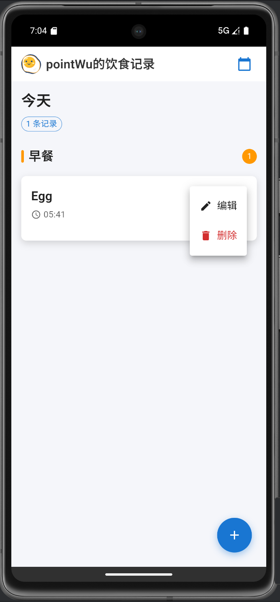
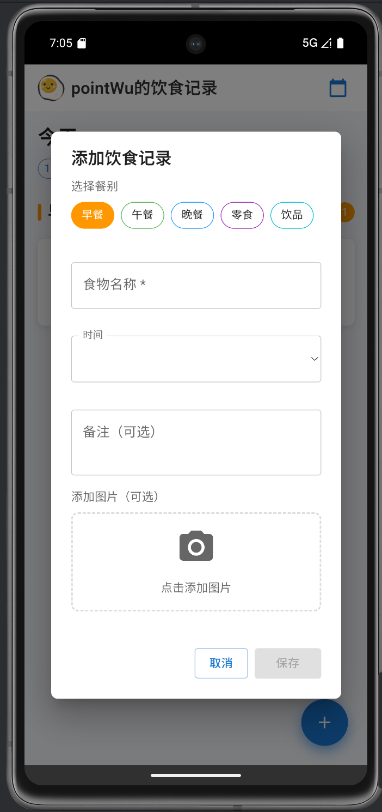

# 饮食记录应用

这是一个基于 Cordova 和 React 的饮食记录应用。

## 截图
<div style="display:flex">


</div>


## 项目结构

```
app/
├── www/                    # Web 应用文件
│   ├── index.html         # 主页面
│   ├── css/               # 样式文件
│   └── js/                # JavaScript 文件
│       ├── index.js       # 入口文件
│       ├── App.jsx        # 主应用组件
│       ├── bundle.js      # 打包后的文件（构建后生成）
│       ├── components/    # React 组件
│       └── utils/         # 工具函数
├── package.json           # 项目配置
├── webpack.config.js      # Webpack 配置
└── config.xml             # Cordova 配置
```

## 安装和运行

### 1. 安装依赖
```bash
npm install
```

### 2. 构建项目
```bash
npm run build
```

### 3. 运行开发服务器
```bash
npm run serve
```

然后在浏览器中访问 `http://localhost:8080`

### 4. 开发模式（自动重新构建）
```bash
npm run dev
```


### 运行在电脑的虚拟机
```bash
cordova run android
```


### 打包
```bash
cordova build android
```


## 功能特性

- 📅 日历视图选择日期
- 🍽️ 添加饮食记录（早餐、午餐、晚餐、零食、饮品）
- 📸 拍照或选择图片
- 💾 本地数据库存储
- 📱 响应式设计，支持移动设备

## 技术栈

- **前端框架**: React 18
- **UI 组件库**: Material-UI (MUI)
- **构建工具**: Webpack + Babel
- **移动端**: Apache Cordova
- **数据库**: SQLite (移动端) / Web SQL (浏览器)

## 问题解决

如果遇到白屏问题，请检查：

1. 是否已运行 `npm install` 安装依赖
2. 是否已运行 `npm run build` 构建项目
3. 浏览器控制台是否有错误信息
4. 确保 `www/js/bundle.js` 文件存在

## 开发说明

- 修改 JSX 文件后需要重新构建
- 使用 `npm run dev` 可以自动重新构建
- 在浏览器中测试功能，然后部署到移动设备 